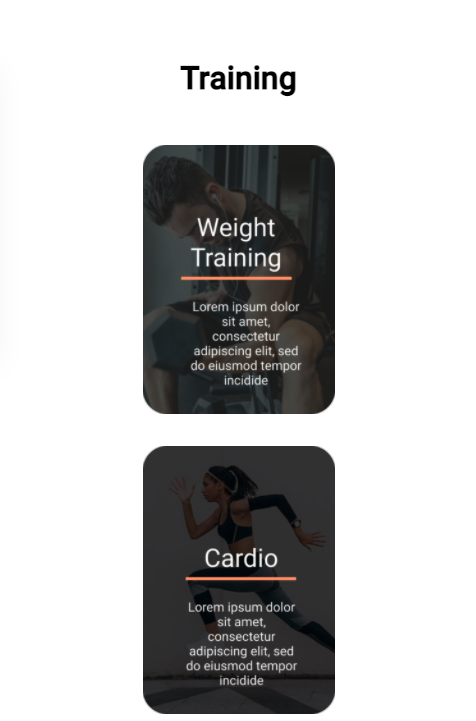
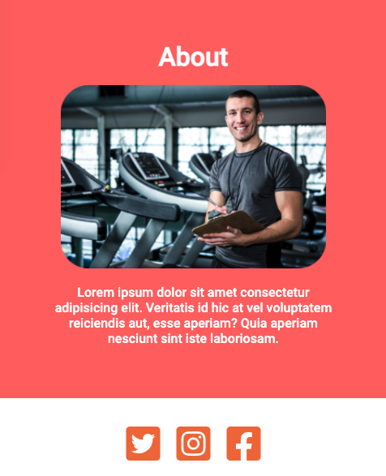

# Fitness-Site
A sample fitness site that's responsive created using HTML, CSS, and Javascript.

 

# Screenshots

 

 

 

 

# Technologies Used & Features
**Implemented using:** 
* HTML
* CSS & Flexbox
* Javascript

 

**Features:** 
* Home page with navigation that is mobile responsive (converts to hamburger drop down menu when window shrinked)
* Javascript used for navigation functionality
* Utilized flexbox for column separation within in each page
* Media queries used for responsiveness
